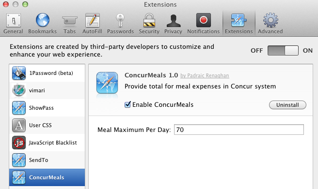
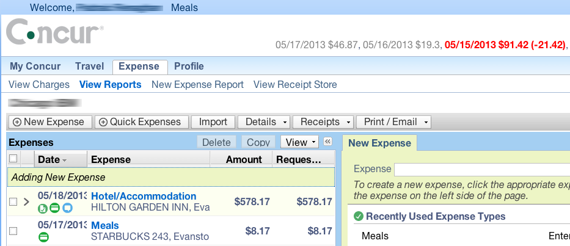

ConcurMeals Safari Extension
=======================

Safari Extension to provide assistance in managing to a daily maximum meal allowance when
entering expenses using Concur

The extension adds a "Meals" item to the top of the screen, near the Welcome text. Click
"Meals" and the extension will find all expenses of "Meals" type, add them up grouped by
date, compare the daily total to the maximum you defined in the extension settings, and 
show the results to the right of the Concur logo.

If a day is within the maximum then the total appears in grey. If the day is over the maximum
then the total appears in red with the overage amount beside it in parentheses.

Installation
============

[Download the ConcurMeals Safari Extension](https://github.com/prenagha/ConcurMealsExtension/raw/master/ConcurMeals.safariextz)

Double-click the downloaded ConcurMeals.safariextz file to install it in Safari.

Visit Safari Preferences, Extensions, ConcurMeals and
enter your daily maximum meal allowance.

Screenshots
===========

Changes
=======

v1.1: Developer Id change

v1.0: Initial release

